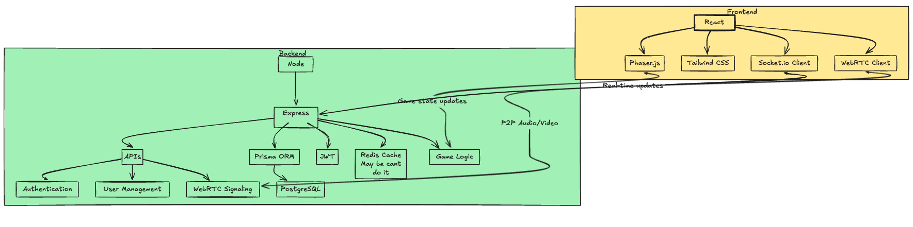

2D Metaverse Game

Technologies Used
### Frontend:
- **React**: For building the user interface.
- **Vite**: A development environment for fast builds and hot-reloading.
- **Phaser.js**: A game framework used for rendering the 2D game environment.
- **Tailwind CSS**: For styling the app's UI.
- **Socket.io**: For real-time communication between clients and the server.
- **WebRTC**: To enable video/audio chat when players are near each other
  
### Backend:
- **Node.js**: Backend server for handling API requests and WebRTC signaling.
- **Express.js**: For handling API routes and middleware.
- **Prisma ORM**: For database interaction with **PostgreSQL**.
- **PostgreSQL**: Relational database for storing user and game data.
- **JWT**: For authentication and session management.
- **Socket.io**: Used for handling real-time multiplayer events.

## Features
- **Multiplayer Game**: Real-time interaction between players in the same virtual room.
- **Avatar Movement**: Use the arrow keys to move your avatar in the 2D game world.
- **Object Interactions**: Players can interact with in-game objects like chairs or doors.
- **Proximity-Based Video/Audio**: When players are near each other, WebRTC enables video and audio communication.
- **Authentication**: Users can sign up, log in, and join different game rooms.

